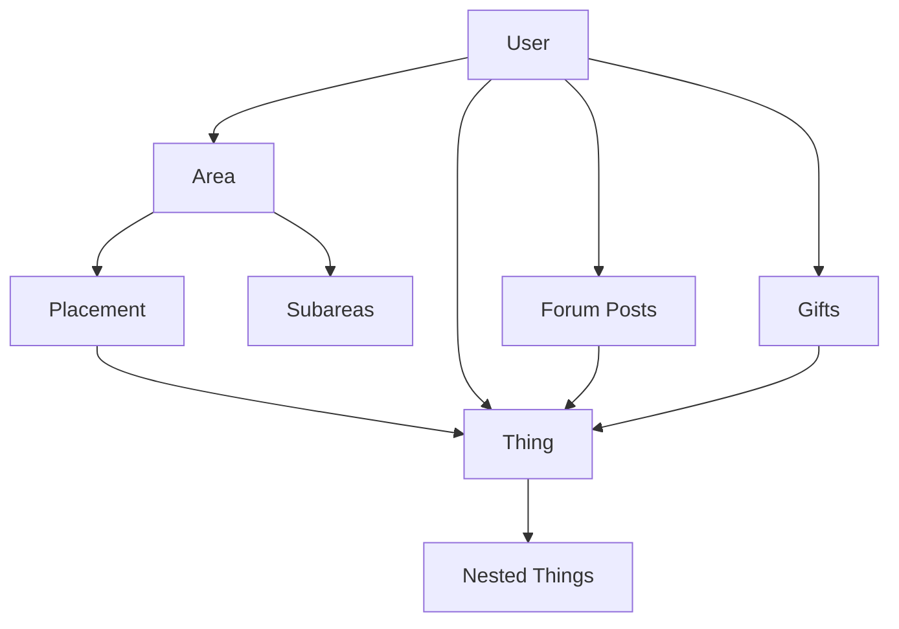

# Data Relationships

This document describes how different types of data in the Libreland server relate to each other.

## Core Relationships

## Detailed Relationships

### Areas and Things
- Areas contain placements
- Placements reference specific things
- Things can be nested within other things
- Areas can have subareas
- Areas track their creators and editors

### Users and Content
- Users can create areas
- Users can create things
- Users can place things in areas
- Users can gift things to other users
- Users can tag things
- Users can post in forums
- Users can be editors of areas

### Forums and Content
- Forums contain threads
- Threads can reference things
- Threads track their creators
- Comments within threads track their authors
- Comments can reference things

### Things and Nesting
- Things can contain other things as parts
- Things track their original creator
- Things can be cloned from other things
- Things can emit other things
- Things can be tagged by users

### Gifts and References
- Gifts link a sender (user) to a receiver (user)
- Gifts contain thing references
- Gift history is tracked per user